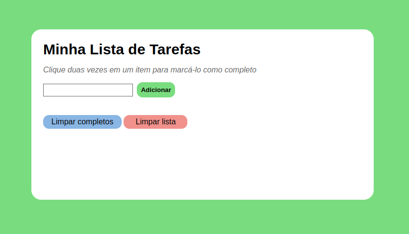

# Projeto Lista de tarefas

Projeto desenvolvido durante o curso da Trybe para fixação de aprendizados. O objetivo era criar uma lista de tarefas em que fosse possível adicionar, marcar e excluir o que já foi concluído ou excluir a lista toda. 

Foi praticado HTML, CSS e Javascript com a manipulação do DOM.

